```mermaid
flowchart TD
    %% Main Game Components
    Main[Main Loop] --> Game[Game Structure]
    Game --> |Contains| Renderer[SDL Renderer]
    Game --> |Contains| Window[SDL Window]
    Game --> |Contains| Background[Background]
    Game --> |Contains| Audio[Audio System]
    Game --> |Contains| Players[Players]
    Game --> |Contains| Blocks[Blocks/Platforms]
    Game --> |Contains| Camera[Camera]
    Game --> |Contains| Lava[Lava]
    
    %% Initialization Flow
    Main --> InitSDL[Initialize SDL]
    Main --> InitNetwork[Initialize Network]
    Main --> InitGameBeforeMenu[Init Game Before Menu]
    Main --> VideoIntro[Play Intro Video]
    Main --> RunMenu[Run Menu]
    Main --> InitGameAfterMenu[Init Game After Menu]
    
    %% Game Loop
    Main --> GameLoop[Game Loop]
    GameLoop --> HandleInput[Handle Input]
    GameLoop --> UpdatePlayers[Update Players]
    GameLoop --> UpdateCamera[Update Camera]
    GameLoop --> RenderScene[Render Scene]
    
    %% Player Components
    Players --> PlayerFrames[Player Frames/Animation]
    Players --> PlayerPhysics[Player Physics]
    Players --> PlayerNetworking[Player Networking]
    
    %% Networking Components
    InitNetwork --> SDLNet[SDL_net]
    PlayerNetworking --> NetworkUDP[Network UDP]
    NetworkUDP --> ServerMode[Server Mode]
    NetworkUDP --> ClientMode[Client Mode]
    
    %% Rendering Pipeline
    RenderScene --> DrawBackground[Draw Background]
    RenderScene --> BuildMap[Build Map]
    RenderScene --> DrawLava[Draw Lava]
    RenderScene --> DrawPlayers[Draw Players]
    RenderScene --> DrawPadding[Draw Padding]
    
    %% Input Handling
    HandleInput --> KeyboardEvents[Keyboard Events]
    HandleInput --> PlayerMovement[Player Movement]
    
    %% Physics
    UpdatePlayers --> Collision[Collision Detection]
    UpdatePlayers --> Gravity[Gravity]
    UpdatePlayers --> Movement[Movement]
    
    %% Cleanup
    Main --> CleanupGame[Cleanup Game]
    Main --> CleanupNetwork[Cleanup Network]
    Main --> CleanupSDL[Cleanup SDL]
    
    %% Media Components
    VideoIntro --> FFMPEGMode[FFMPEG Mode]
    VideoIntro --> AudioOnlyMode[Audio Only Mode]
    
    %% Styling
    classDef core fill:#f96,stroke:#333,stroke-width:2px
    classDef rendering fill:#9cf,stroke:#333,stroke-width:2px
    classDef networking fill:#fcf,stroke:#333,stroke-width:2px
    classDef physics fill:#cfc,stroke:#333,stroke-width:2px
    classDef media fill:#ff9,stroke:#333,stroke-width:2px
    
    class Main,Game,GameLoop core
    class Renderer,RenderScene,DrawBackground,BuildMap,DrawLava,DrawPlayers,DrawPadding rendering
    class InitNetwork,SDLNet,PlayerNetworking,NetworkUDP,ServerMode,ClientMode networking
    class PlayerPhysics,Collision,Gravity,Movement physics
    class VideoIntro,FFMPEGMode,AudioOnlyMode,Audio media
```

# KungligaProject Game Architecture

This diagram illustrates the overall architecture of the KungligaProject game. The game is built using C with SDL2 libraries (SDL2, SDL2_image, SDL2_mixer, SDL2_ttf, SDL2_net) and follows a component-based design.

## Key Components

### Core Game Structure
- **Main Loop**: Controls the overall game flow
- **Game Structure**: Contains all game components
- **Game Loop**: Handles input, updates game state, and renders each frame

### Rendering System
- **SDL Renderer**: Manages all rendering operations
- **Drawing Pipeline**: Background → Map → Lava → Players → Padding

### Player System
- **Animation**: Handles player sprite animations
- **Physics**: Manages movement, gravity, and collisions
- **Networking**: Synchronizes player positions between clients

### Networking
- **SDL_net**: UDP-based networking for multiplayer
- **Server/Client Modes**: Game can operate in either mode
- **Player Synchronization**: Transmits player positions between clients

### Media
- **Video Intro**: Optional FFMPEG-based video playback
- **Audio System**: Handles music and sound effects

## Game Initialization Flow
1. Initialize SDL libraries
2. Set up networking (if multiplayer)
3. Initialize game components before menu
4. Play intro video/audio
5. Run menu
6. Initialize remaining game components
7. Enter main game loop

## Cleanup Process
The game properly cleans up all resources when exiting:
1. Game resources
2. Network connections
3. SDL systems
